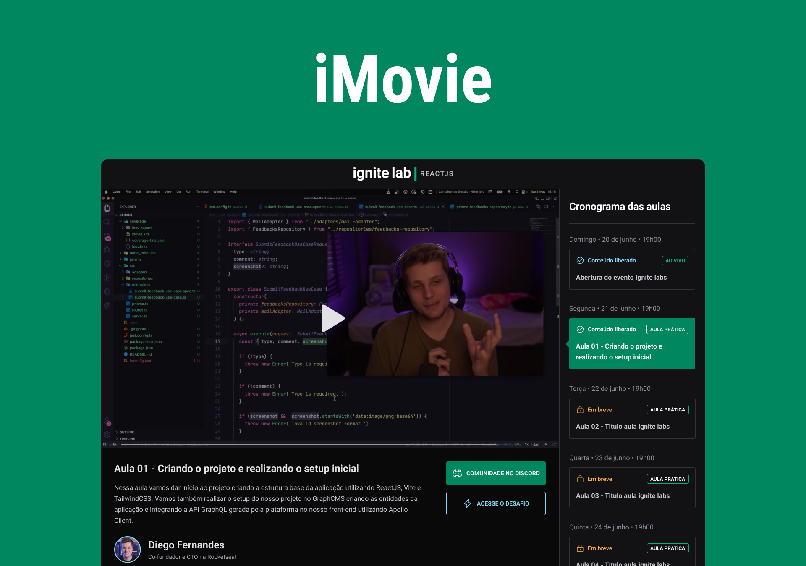

<br>

# iMovies &middot; [](http://makeapullrequest.com) [](https://github.com/matheusm/iMovies/blob/master/LICENSE) 

## Getting started

First of all you need to create your account in [Hygraph](https://hygraph.com/) and clone [My project](https://app.hygraph.com/clone/d3b4513eba0a44fea88b6b0c1762e669?name=Ignite%20Lab%20-%20Matheus%20Martins%20Sar) structure for you.


After this, you need to get your Content API and Permanent Auth Tokens and add it in ``.env.local``:

``` 
VITE_APP_APOLO_API_KEY= Content API
VITE_API_ACCESS_TOKEN= Permanent Auth Token
```

Make sure that you have it before start.

## Developing

### Built With
- [Vite](https://vitejs.dev/)
- [React](https://reactjs.org/)
- [Tailwind](https://tailwindcss.com/)
- [Apollo](https://www.apollo.io/)
- [Vimejs](https://vimejs.com/)
- [Phosphor Icons](https://phosphoricons.com/)
- [Typescript](https://www.typescriptlang.org/)

### Prerequisites
Setup your enviroments


### Setting up Dev

Here's a brief intro about what a developer must do in order to start developing
the project further:

```shell
git clone https://github.com/matheusm/iMovies.git
cd iMovies/
npm install

#remember to add your .env.local

npm run dev

```
Now you can access in your http://localhost:3000

### Building

If your project needs some additional steps for the developer to build the
project after some code changes, state them here. for example:

```shell
npm run build
```

## TODO
- [ ] Loading Component
- [ ] Github Authentication
- [ ] Responsive Layout
- [ ] Design system